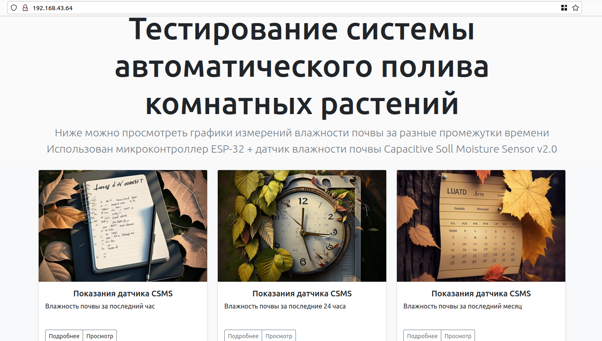
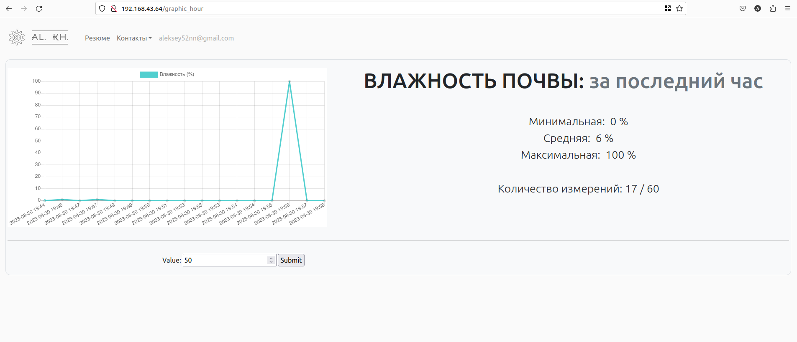
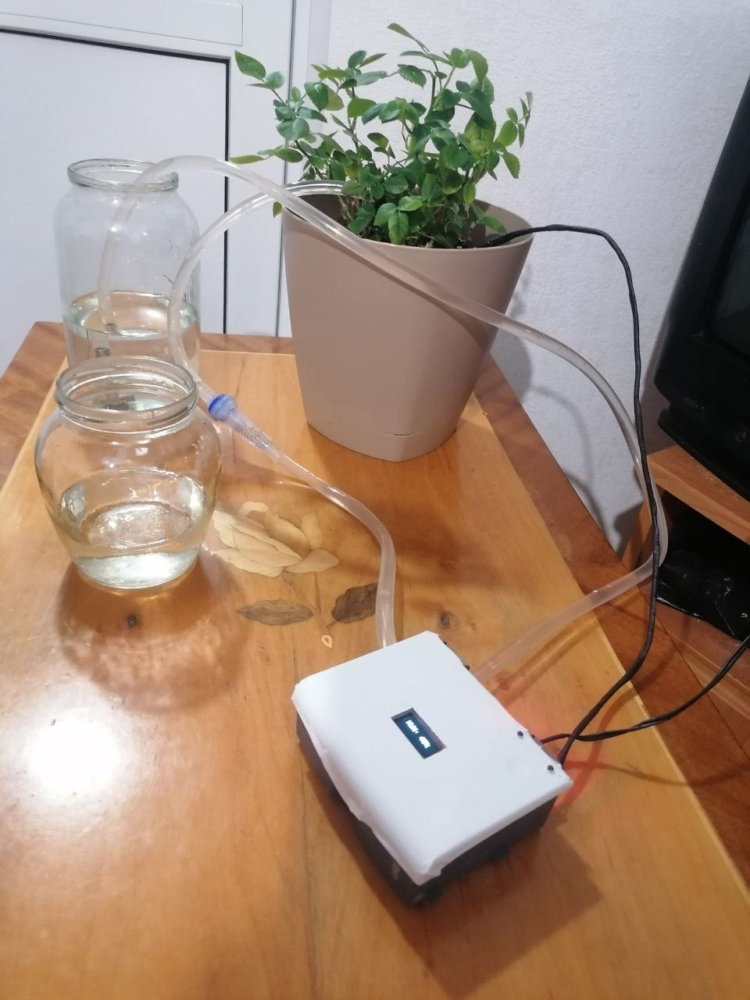
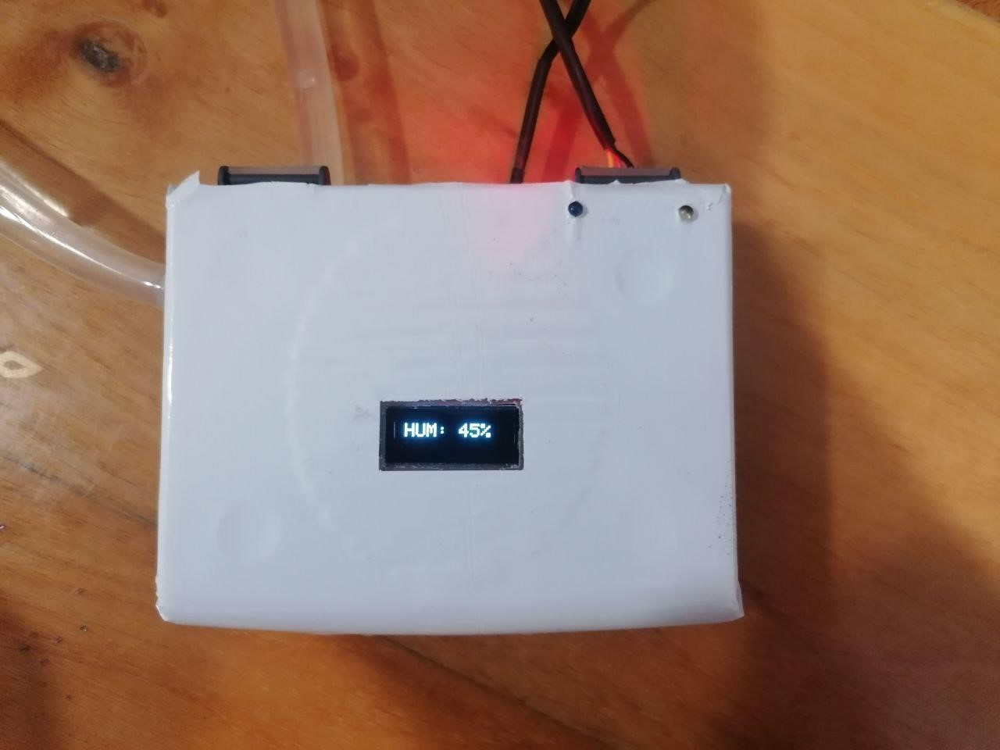
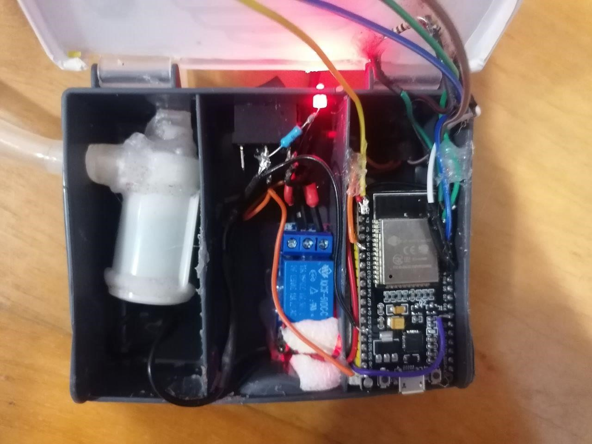
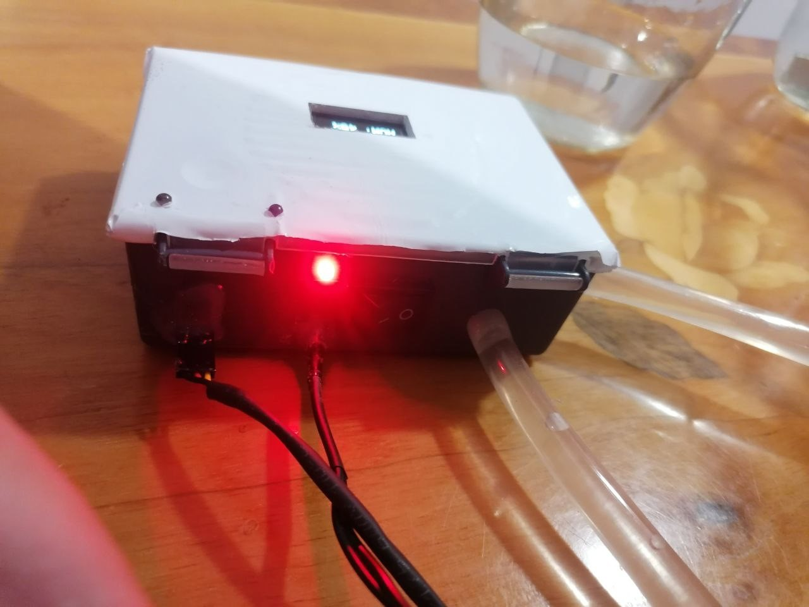
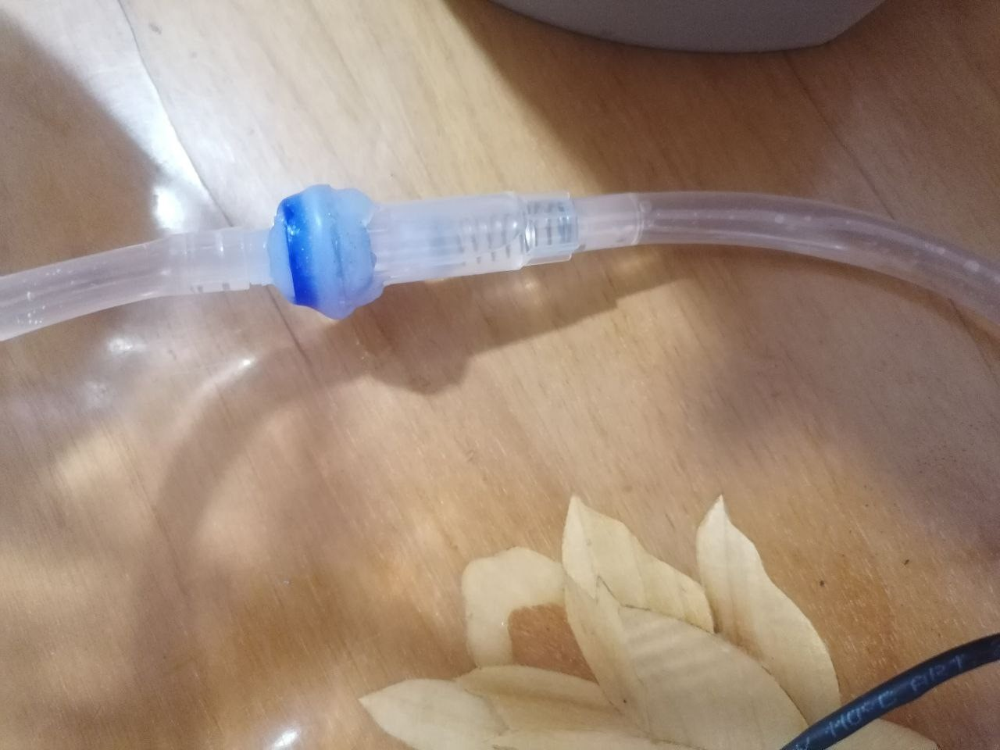

# Automatic Plant Watering System

Этот проект представляет собой автоматическую систему полива комнатных растений, разработанную с использованием Django для веб-интерфейса и ESP32 для управления датчиками и насосами.

## Описание проекта

Система автоматического полива растений предназначена для обеспечения оптимального уровня влажности почвы для комнатных растений. Проект включает в себя:

- Веб-приложение на Django для настройки параметров полива и мониторинга состояния растений.
- Микроконтроллер ESP32 для сбора данных от датчиков влажности и управления насосами.

В проекте использован подход и идея из работы пользователя [Kirim10000](https://github.com/Krim10000) и его репозитория [ESP32-TEMP-WIFI](https://github.com/Krim10000/ESP32-TEMP-WIFI), выпущенного под лицензией GNU General Public License Version 3.

## Установка и запуск

### Веб-приложение на Django

1. Клонируйте репозиторий:
   ```sh
   git clone https://github.com/AlekseyKhaleev/WateringSys.git
    ```
2. Перейдите в директорию Django:

   ```sh
   cd WateringSys/Django_side
   ```
3. Установите необходимые зависимости:

    ```sh
    poetry install
    ```
4. Выполните миграции базы данных:

    ```sh
    python manage.py migrate
    ```
5. Запустите сервер разработки:
    ```sh
    python manage.py runserver
    ```
   
### Микроконтроллер ESP32

1. Перейдите в директорию ESP32:

   ```sh
    cd WateringSys/esp32
    ```
2. Скомпилируйте и загрузите прошивку на ESP32 с помощью Arduino IDE или другого подходящего инструмента.

## Использование

1. Перейдите в веб-интерфейс по адресу http://localhost:8000.
2. Настройте параметры полива и добавьте свои растения.
3. Подключите датчики влажности и насосы к ESP32 и следите за состоянием системы через веб-интерфейс.

## Скриншоты


*Главная страница веб-приложения*


*Графики температуры-влажности*


## Фото рабочего макета


*Рабочий макет системы полива*


*Лицевая сторона блока управления*


*Начинка блока*


*Питание/вывод датчиков*


*Обратный клапан насоса (DIY)*

## Лицензия

Этот проект лицензирован под лицензией GNU General Public License Version 3. Подробности можно найти в файле `LICENSE`.

## Благодарности

Особая благодарность пользователю Kirim10000 за его проект ESP32-TEMP-WIFI, который послужил основой для этого проекта.
